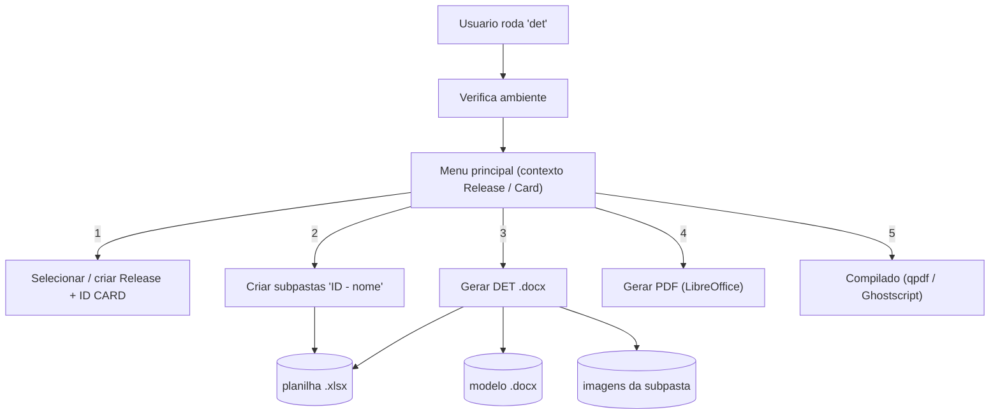

# AGENTS.md — Gestor de Documentos de Testes (DET)

Instruções para agentes de IA (e pessoas) que forem trabalhar neste repositório.

## O que é

Ferramenta de **terminal (TUI) em Rust** que organiza evidências de testes manuais e
gera os **DETs** (Documento de Evidência de Testes) em `.docx` / `.pdf`. O binário se
chama `det`, roda na pasta de trabalho do usuário, é interativo (menu por número) e
**não usa rede nem servidor**. Detalhes de uso final: veja o `README.md`.

## Como construir, rodar e testar

```bash
cargo run                 # abre o menu (pasta atual como area de trabalho; use --base <dir>)
cargo build --release     # binario otimizado em target/release/det
cargo install --path .    # instala o comando `det` no PATH (~/.cargo/bin)
cargo test                # suite de testes (um arquivo por funcionalidade em tests/)
```

> Sempre rode `cargo test` após mexer em `docx.rs`, `xlsx.rs`, `acoes.rs` ou `util.rs`.
> O teste de escape/tokens em `tests/docx_engine.rs` é uma regressão importante.

## Arquitetura (simples)

Fluxo: o usuário roda `det` → vê o **check de ambiente** → escolhe uma ação no **menu**
→ cada ação opera sobre o **contexto** (Release + ID CARD) selecionado na opção 1.



### Módulos (`src/`)

| Arquivo | Responsabilidade |
|---|---|
| `main.rs` | Binário: laço do menu, contexto (Release+Card), dispatch das ações, check de ambiente. |
| `lib.rs` | Expõe os módulos para o binário **e** para os testes de integração. |
| `menu.rs` | Desenho do menu, cabeçalho de contexto, navegação (passos, "voltar"), prompts. |
| `workspace.rs` | Descoberta de `Release/`, `ID CARD`, `modelos/` e da planilha mais recente. |
| `acoes.rs` | As ações: criar subpastas, gerar docx, gerar pdf, gerar compilado (`bin_pack`). |
| `xlsx.rs` | Leitor de `.xlsx` (ZIP+XML; shared strings/inlineStr) + mapeamento tolerante de cabeçalhos. |
| `docx.rs` | Motor de `.docx` (ZIP+XML): preenche tokens (robusto a *run-splitting*) e insere imagens. |
| `pdf.rs` | Integração com ferramentas externas: LibreOffice, qpdf, Ghostscript. |
| `util.rs` | Ordenação natural, normalização/acentos, datas, escape XML. |

Regra de dependência: `main` → (`menu`, `acoes`, `workspace`, `pdf`, `util`); `acoes` →
(`docx`, `xlsx`, `pdf`, `workspace`, `util`). `docx`/`xlsx` dependem só de `util` + `zip`.

### Estrutura em disco (área de trabalho do usuário)

```txt
<pasta-de-trabalho>/
├─ modelos/modelo_det.docx
├─ Release/Release <Mes> <Ano>/ID CARD <n>/<ID> - <nome>/ (imagens + DET gerado)
└─ teste_selected_*.xlsx        # a planilha mais recente e usada
```

## Dependências

- **Única dependência de crate:** `zip`. `.docx` e `.xlsx` são manipulados como ZIP+XML na mão — **não adicionar crates** sem necessidade real (ex.: parsing de docx/xlsx deve continuar manual).
- **Externas (opcionais, só para PDF):** LibreOffice (ação 4), qpdf (ação 5), Ghostscript (compressão opcional). O binário localiza cada uma no PATH; a ação avisa se faltar.

## Convenções e regras

- Mensagens ao usuário em **português**; nomes de função/variável em português; comentários idem.
- **Tokens do modelo** (não quebrar): `{{ID}}`, `{{NOME_TESTE}}`, `{{EXECUTADO_POR}}`, `{{STATUS}}`, `{{DATA}}`, `{{EVIDENCIAS}}`. Texto estático do modelo é escapado antes de reescrever os runs.
- **Colunas obrigatórias da planilha:** `ID`, `Nome do teste (inicial)`, `Executado por`, `Status nativo`. O casamento é tolerante a acento, caixa, espaços e pontuação (aliases em `xlsx.rs`).
- `Status nativo = Ignorado` → **não** gera DET.
- Imagens sempre em **ordem natural** (`1, 2, 10`), diretamente na subpasta do ID.
- **Não versionar** evidências nem saídas: `Release/`, `DET_*`, `teste_selected_*.xlsx` já estão no `.gitignore`. `Cargo.lock` **é** versionado (binário).
- Nada de scripts com IDs/caminhos fixos: tudo vem por parâmetro, pela planilha ou pela seleção no menu.

## Onde mexer (pontos comuns)

- **Formato do nome da release** (`Release <Mes> <Ano>`): `criar_nova_release` em `src/menu.rs`.
- **Fuso/data** (hoje em UTC): `offset_local` em `src/util.rs`.
- **Limite do compilado** (default 30 MB): parâmetro de `gerar_compilado` em `src/acoes.rs`.
- **Menu / navegação**: `selecionar_acao`, `selecionar_release`, `selecionar_card` em `src/menu.rs`.

## Testes

`tests/` tem **um arquivo por funcionalidade** — `organizar`, `gerar_docx`, `gerar_pdf`,
`gerar_compilado`, `leitura_planilha`, `docx_engine`, `util`, `ambiente` — mais
`tests/common/mod.rs` com as *fixtures* (gera `.xlsx`/`.docx`/PNG em memória via `zip`,
sem depender de LibreOffice/qpdf). Áreas de trabalho de teste são criadas em `TEMP` e
removidas no `Drop`. As ações que dependem de ferramentas externas são cobertas pelos
caminhos determinísticos (erros e `bin_pack`), então `cargo test` roda em qualquer máquina.
